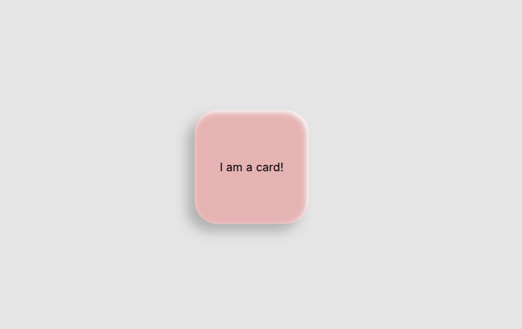

This is a basic proof-of-concept reading the device's orientation (if available) to dynamically update css variables. 
In this example, the light reflections and shadow will always point into the same direction, no matter how you twist and turn your device.
